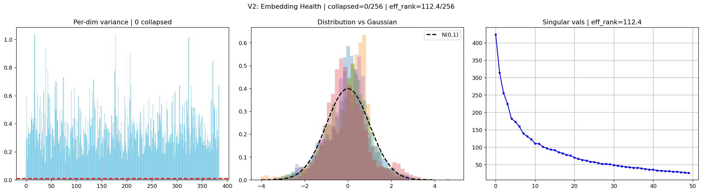
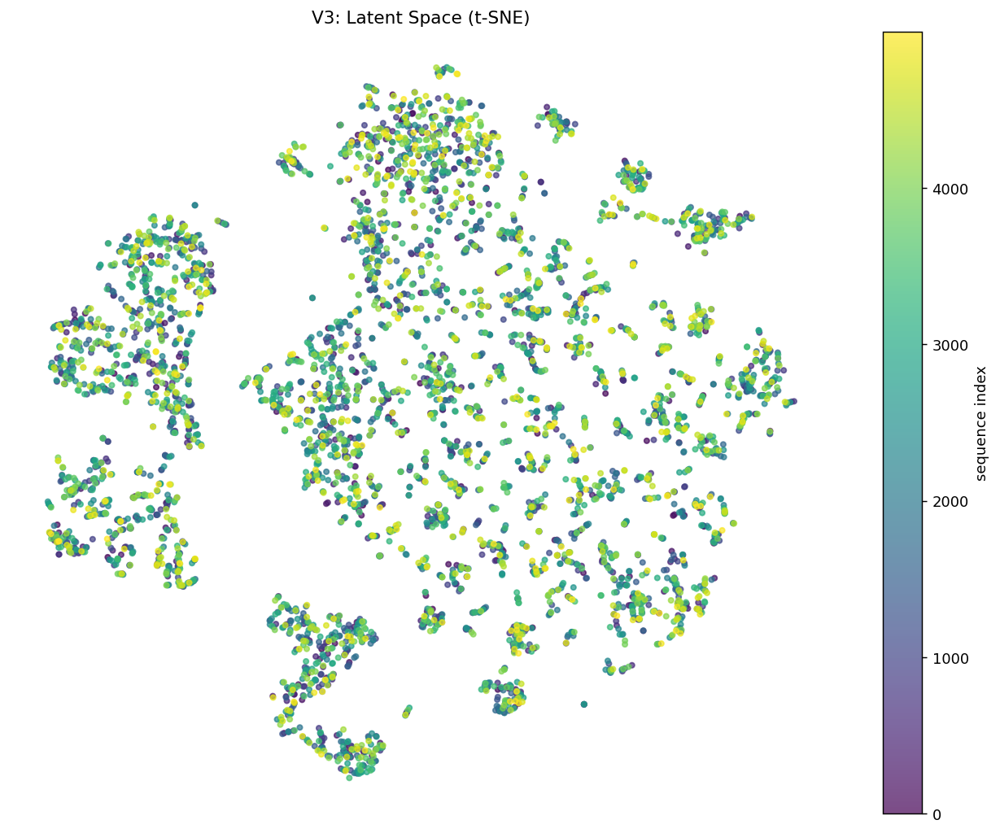
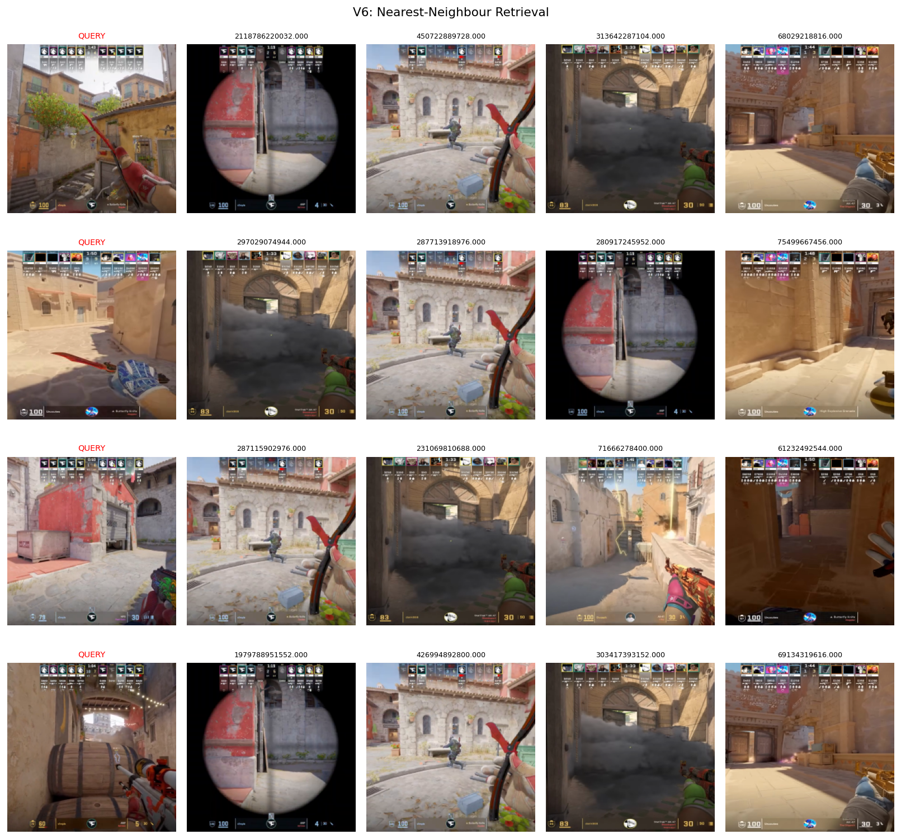
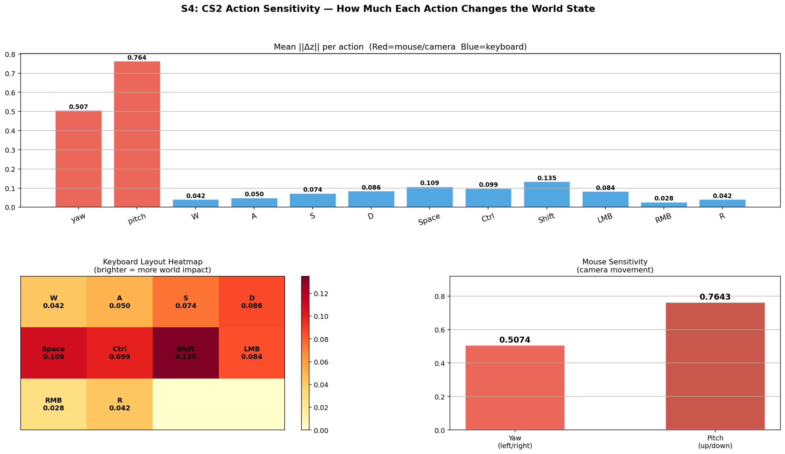
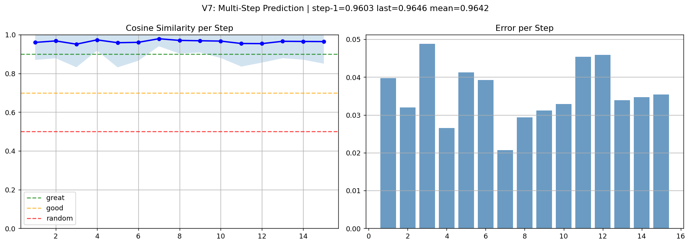

# CS2-LeWM

Latent world model experiments for Counter-Strike 2, trained from POV gameplay clips using a LeWorldModel-style setup.

Repository: https://github.com/fanXvirat/lewm-cs2

## Project Layout

```text
cs2lewm/
|- train.py
|- cs2_showcase_tests.py
|- index.html
|- README.md
`- assets/
   |- CEM_planner.png
   |- delta_analysis.png
   |- per_key_analysis.png
   |- S1_embedding_health.png
   |- S2_tsne.png
   |- S3_reconstructions.png
   |- S4_action_sensitivity.png
   |- S5_direction_showcase.png
   |- V1_action_sensitivity.png
   |- V2_embedding_health.png
   |- V3_tsne.png
   |- V4_reconstruction.png
   |- V5_interpolation.png
   |- V6_nn_retrieval.png
   |- V7_prediction_quality.png
   `- V9_action_trajectories.png
```

## Quick Start

Install dependencies:

```bash
pip install torch torchvision transformers einops opencv-contrib-python-headless scikit-learn matplotlib numpy
```

Run smoke check:

```bash
python train.py --stage smoke
```

Run full training budget:

```bash
python train.py --stage all --budget-hours 3.4
```

Run evaluation only:

```bash
python train.py --stage eval
```

## Core Notes

- `train.py` is the cleaned main training and evaluation script.
- `cs2_showcase_tests.py` contains analysis notebook cells and now imports from `train`.
- `assets/` stores all test and result images used by `index.html` and this README.
- `index.html` is a light-themed academic project page suitable for GitHub Pages.

## Sample Figures







## Credits

- LeWorldModel paper: https://arxiv.org/abs/2603.19312
- Original implementation reference: https://github.com/lucas-maes/le-wm